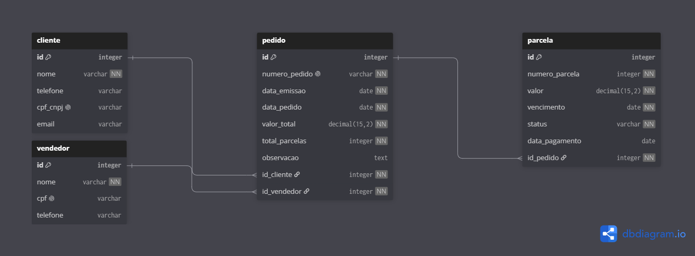

# SisteMix

<p align="center">
  
  
  
  
  
  

</p>

> Sistema web para **acompanhamento e consulta de boletos parcelados**. Permite que múltiplas máquinas na rede de uma empresa consultem e atualizem o status de parcelas em tempo real. O sistema não emite boletos, registra e acompanha os que já foram gerados externamente.

---

## Sumário

- [Funcionalidades](#funcionalidades)
- [Tecnologias](#tecnologias)
- [Estrutura do projeto](#estrutura-do-projeto)
- [Modelagem](#modelagem)
- [Como executar](#como-executar)
- [Documentação da API](#documentação-da-api)

---

## Funcionalidades

| Status | Funcionalidade |
|--------|----------------|
| ✅ | Listagem de parcelas com filtros por status, vencimento e valor |
| ✅ | Atualização manual de status (Pago, Pendente, Em atraso) |
| ✅ | Geração automática de parcelas ao cadastrar um pedido |
| ✅ | Divisão de valor com arredondamento aplicado à última parcela |
| ✅ | CRUD completo de Clientes, Vendedores e Pedidos via API REST |
| 🔜 | Cadastro de Pedidos, Clientes e Vendedores via interface web |
| 🔜 | Dashboard com resumo financeiro (total em carteira, pago, em atraso) |
| 🔜 | Autenticação e controle de acesso |

---

## Tecnologias

### Backend

| Tecnologia | Versão | Uso |
|------------|--------|-----|
| Java | 26 | Linguagem principal |
| Spring Boot | 4.0 | Framework web |
| Spring Data JPA | — | Persistência |
| PostgreSQL | — | Banco de dados |
| Flyway | — | Migrations do banco |
| Bean Validation | — | Validação de dados |
| Lombok | — | Redução de boilerplate |

### Frontend

| Tecnologia | Uso |
|------------|-----|
| React 19 + TypeScript | Interface e tipagem |
| Vite | Build e dev server |
| Material UI (MUI) | Componentes e design system |
| MUI X Data Grid | Tabela de parcelas |
| TanStack Query | Busca e cache de dados da API |
| Axios | Cliente HTTP |
| dayjs | Manipulação de datas |
| React Router | Navegação entre telas |

---

## Estrutura do projeto

```
SisteMix/
├── backend/
│   ├── src/main/java/org/siste/mix/
│   │   ├── client/             # Entidade, repositório, service, controller e DTOs
│   │   ├── seller/
│   │   ├── order/
│   │   ├── installment/
│   │   └── config/             # CORS
│   ├── src/main/resources/
│   │   └── db/migration/       # Scripts Flyway (V1–V6)
│   ├── docs/
│   │   └── bruno/              # Coleção de requisições (Bruno API client)
│   └── pom.xml
└── frontend/
    └── src/
        ├── api/                # Cliente Axios + um arquivo por domínio
        ├── components/         # Componentes reutilizáveis (Layout)
        ├── pages/              # Telas da aplicação
        ├── types/              # Interfaces TypeScript
        ├── utils/              # Formatação (moeda, data, status)
        └── theme/              # Tema MUI
```

---

## Modelagem

<p align="center">
  
</p>

---

## Como executar

### Pré-requisitos

- Docker
- Java 26
- Node.js 20+

### 1. Banco de dados

```bash
docker run --name sistemix-db \
  -e POSTGRES_PASSWORD=postgres \
  -e POSTGRES_DB=sistemix \
  -p 4747:5432 \
  -d postgres
```

### 2. Backend

```bash
cd backend
./mvnw spring-boot:run
```

A API estará disponível em `http://localhost:8080`.

### 3. Frontend

```bash
cd frontend
npm install
npm run dev
```

A aplicação estará disponível em `http://localhost:5173`.

---

## Documentação da API

A coleção completa de requisições está disponível para o [Bruno API Client](https://www.usebruno.com/) em `backend/docs/bruno/`.

| Método | Endpoint | Descrição |
|--------|----------|-----------|
| GET | `/clients` | Lista clientes ativos |
| POST | `/clients` | Cadastra cliente |
| PUT | `/clients` | Atualiza cliente |
| DELETE | `/clients/{id}` | Desativa cliente (soft delete) |
| GET | `/sellers` | Lista vendedores ativos |
| POST | `/sellers` | Cadastra vendedor |
| PUT | `/sellers` | Atualiza vendedor |
| DELETE | `/sellers/{id}` | Desativa vendedor |
| GET | `/orders` | Lista pedidos ativos |
| POST | `/orders` | Cadastra pedido e gera parcelas automaticamente |
| PUT | `/orders` | Atualiza pedido |
| DELETE | `/orders/{id}` | Desativa pedido |
| GET | `/installments` | Lista parcelas com filtros opcionais |
| GET | `/installments/{id}` | Detalhe de uma parcela |
| GET | `/installments/order/{id}` | Lista parcelas de um pedido |
| PATCH | `/installments/{id}/status` | Atualiza status de uma parcela |

**Filtros disponíveis em `GET /installments`:** `status`, `dueDateFrom`, `dueDateTo`, `amountMin`, `amountMax`
